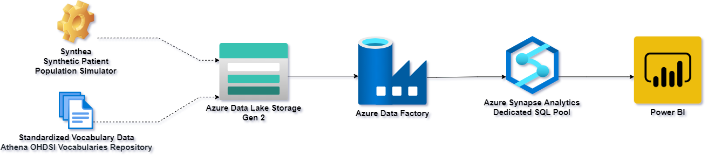

# Synthea to OMOP ETL on Azure Synapse

## Contents

1. [Objective](#objective)
2. [Background](#background)
3. [Architecture](#architecture)
4. [Tutorial](#tutorial)
5. [Contributors](#contributors)
6. [Acknowledgements](#acknowledgements)

## Objective 

Effective healthcare research relies on standardized health data and on modern data warehousing technologies. Yet, the lack of suitable healthcare data, inconsistencies in data formats, and the challenges of loading such data to modern cloud-based data warehouses impedes the development of healthcare analytics solutions.

The purpose of this project is to **accelerate healthcare analytics by demonstrating an end-to-end process of transofrming synthetic healthcare data (generated by [SyntheaTM](https://synthetichealth.github.io/synthea/)) from delimited text files into a widely-adopted common data model format ([OMOP](https://www.ohdsi.org/data-standardization/the-common-data-model/)) using [Azure Data Lake Storage](https://docs.microsoft.com/en-us/azure/storage/blobs/data-lake-storage-introduction), [Azure Data Factory](https://docs.microsoft.com/en-us/azure/data-factory/introduction), and [Azure Synapse Analytics](https://docs.microsoft.com/en-us/azure/synapse-analytics/overview-what-is)**.

## Background 

**[Observation Medical Outcomes Partnership (OMOP) Common Data Model (CDM)](https://www.ohdsi.org/data-standardization/the-common-data-model/)** allows for the systematic analysis of disparate observational databases by transforming raw health data into a common format (data model) as well as a common representation (terminologies, vocabularies and coding schemes). OMOP is favored by healthcare researchers for its simplicity and accessibility.

> This project is based on OMOP CDM version 5.3.1.

**[SyntheaTM](https://synthetichealth.github.io/synthea/)** is an open-source Synthetic Patient Population Simulator that outputs realistic, but not real, patient data and associated health records in a variety of formats. The syntheic healthcare data, are free from cost, privacy, and security restrictions, enabling research  that would be legally or practically unfeasible. While Synthea supports multiple output formats, OMOP is not one of them.

**[Azure Synapse Analytics](https://docs.microsoft.com/en-us/azure/synapse-analytics/overview-what-is)** is a massively scalable, cloud-based analytics platform that brings together enterprise data warehousing, data engineering and Big Data analytics.

**[Azure Data Factory](https://docs.microsoft.com/en-us/azure/data-factory/introduction)** is a cloud-based data integration service that allows you to create data-driven workflows for orchestrating data movement and transformation at scale.

**[Azure Data Lake Storage](https://docs.microsoft.com/en-us/azure/storage/blobs/data-lake-storage-introduction)** is a cloud-based storage platform that serves as the foundation for building enterprise data lakes.

## Solution Architecture 

The solution leverages several resources in Microsoft Azure:

* Azure Data Lake Storage (Generation 2) account
* Azure Data Factory
* Azure Synapse Analytics Workspace with a Dedicated SQL Pool
* Power BI

Data transformation and loading is orchestrated using Azure Data Factory pipelines illustrated on the following diagram:

Following is a brief overview of the activities performed by each Data Factory pipeline:

* **01-Initialize Database**: retrieves a list of SQL scripts from a designated directory in the data lake and executes the scripts in the Synapse Dedicated SQL Pool to create database tables for staging raw data and for storing the data in an OMOP-compatible schema.

* **02-Stage Synthea CSV files to Synapse Tables**: retrieves a list of CSV files with synthetic patient data from a designated directory in the data lake and loads them into corresponding staging tables in the Synapse Dedicated SQL Pool.

* **03-Stage Vocabulary to Synapse Tables**: retrieves a list of CSV files with vocabulary data from a designated directory in the data lake and loads them into corresponding staging tables in the Synapse Dedicated SQL Pool.

* **04-Transform Data and Load CDM Tables**: retrieves a list of SQL scripts from a designated directory in the data lake and executes the scripts in the Synapse Dedicated SQL Pool to transform the data from its original format into an OMOP-compatible schema, while standardizing terminologies, vocabularies and coding schemes.

## Tutorial 

### 1 Prerequisites

#### 1.1 Access to Azure Subscription

To complete this tutorial, you need to have access to an Azure resource group for which you are assigned the Owner role. You will deploy all required resources within this resource group.

#### 1.2 A copy of this GitHub repository cloned (or downloaded) to your local computer

You will need certain scripts stored in this repository to complete this tutorial. You may download a copy of the repository by navigating to <https://github.com/slavatrofimov/Synthea-OMOP-on-Synapse> and clicking on the "Code" button as illustrated below.

.

Please unzip the repository after downloading it to your local computer.

#### 1.3 Standardized vocabulary data

You will need a set of CSV files with standardized vocabularies downloaded from the Athena OHDSI Vocabularies Repository. Please register for a free account at <https://athena.ohdsi.org/>. Then, navigate to the [Download](https://athena.ohdsi.org/vocabulary/list) page and select the following vocabulary types:

* **SNOMED** Systematic Nomenclature of Medicine - Clinical Terms (IHTSDO)
* **LOINC** Logical Observation Identifiers Names and Codes (Regenstrief Institute)
* **CVX** CDC Vaccine Administered CVX (NCIRD)
* **RxNorm** RxNorm (NLM)

Please verify that your selected list of vocabularies matches the following screenshot:

.

Once you are notified that your vocaulary files are ready, please donwload them and unzip them on your local computer.

#### 1.4 Synthetic healthcare data

You will also need a set of synthetic healthcare records in CSV format (generated using the Synthea tool).

> ##### How do I generate synthetic health data?
>
> This tutorial assumes that you have generated a set of synthetic healthcare records using the Synthea synthetic patient population simulator and saved the outputs to a CSV format.
>
>The process of generating synthetic records using Synthea tools is outside of the scope of the current project. Please visit [SyntheaTM](https://synthetichealth.github.io/synthea/) to learn more about the tools and usage guidelines.
>If you do not have a suitable synthetic dataset in CSV format, consider starting with a pre-generated dataset of health records for simulated COVID-19 patients:
>
> * 10,000 patients (54MB of compressed data or about 500MB of decompressed data): [https://synthetichealth.github.io/synthea-sample-data/downloads/10k_synthea_covid19_csv.zip](https://synthetichealth.github.io/synthea-sample-data/downloads/10k_synthea_covid19_csv.zip)
> * 100,000 patients (512MB of compressed data or about 5GB of decompressed data): [http://hdx.mitre.org/downloads/syntheticmass/100k_synthea_covid19_csv.zip](http://hdx.mitre.org/downloads/syntheticmass/100k_synthea_covid19_csv.zip)

### 2 Provision Azure resources

We will use two pre-built Azure Resource Manager (ARM) templates to provision resources to your Azure subscription.

#### 2.1 Provision Data Lake, Synapse Workspace and Dedicated SQL Pool

Let's start by provisioning an Azure Storage Account (which will serve as our data lake) as well as an Azure Synapse Analytics Workspace with a Dedicated SQL Pool (which will serve as our data warehouse).

>Note, if you already have a storage account (Data Lake) and a Synapse Analytics Workpsace with a Dedicated SQL Pool, feel free to skip this deployment and use your existing resources. However, please be aware that database initialization scripts are designed to delete all existing objects in several data warehouse schemas, such as *synthea, omop, helper and vocab* (or alternative names that you specify).
>
> **To avoid unintententional deletion of data, exercise caution when deploying this POC solution to an existing dedicated SQL pool.**

Click on the "Deploy to Azure" button below to initiate the deployment.

If necessary, sign into the Azure Portal and provide information requested by the template, as illustrated below:

.

* **Subscription**: from a drop-down list, select a subscription to which you will deploy the new Azure resources.
* **Resource group**: Select a resource group to which you will deploy the new Azure resources (or create a new one).  We recommend creating a new resource group for convenience.
* **Region details**: will be pre-seleted based on the region of the resource group.
* **Company Tla**: a three-letter acronym for your company that will serve as a prefix in the naming scheme of new Azure resources that will be provisioned.
* **Allow All Connections**: set to true to allow connections to simplify connectivity to your Azure resources as part of this POC.
* **Deployment type**: set to **poc**. This will be used as part of the naming schme for your resources.
* **Sql Administrator Login**: username of the account that will serve as an administrator for your Synapse dedidcated SQL pool. Be sure to record this value for future use.
* **Sql Administrator Login Password**: password of the account that will serve as an administrator for your Synapse dedidcated SQL pool. Be sure to record this value for future use.
* **Sku**: select the size of your dedicated SQL pool from the drop-down list. We recommend DW200c for this POC.

#### 2.2 Provision Azure Data Factory and Pipelines

Then, let's continue by deploying an Azure Data Factory with the necessary pipelines that will be used to orchestrate the data transformation and loading activities. Click on the "Deploy to Azure" button below to initiate the deployment.

Provide information requested by the template, as illustrated below:

.

* **Subscription**: from a drop-down list, select a subscription to which you will deploy the new Azure resources.
* **Resource group**: Select a resource group to which you will deploy the new Azure resources (or create a new one).  We recommend deploying the data factory to the same resource group that you created or selected in the previous step.
* **Region details**: will be pre-seleted based on the region of the resource group.
* **Company Tla**: a three-letter acronym for your company that will serve as a prefix in the naming scheme of new Azure resources that will be provisioned.
* **Adls Url**: a URL of the data lake endpoint of your storage account. It will typically look like this: *<https://mydatalakename.dfs.core.windows.net/>*
* **ADLS Account Key**: secret key of your ADLS account. It will typically look like this: *JVv0KQTOJw/tAP5zKKiIgcUkYfGlyW0PYGK6PdN1b9JpoMnyiTv7ksY1hpHIQiRKjHmILr0kWx23arKATy0NZA==*
* **Synapse Dedicated SQL Endpoint**: dedicated SQL endpoint for your Synapse Analytics workspace. It will typically look like **mySynapseSQLPool.sql.azuresynapse.net**
* **Synapse Dedicated SQL Pool Name**: name of the Dedicated SQL Pool.
* **Synapse SQL User Name**: username of the account accessing the dedicated SQL pool.
* **Synapse SQL Password**: password of the account accessing the dedicated SQL pool.

### 3 Upload SQL scripts and raw data to the data lake

#### 3.1 Create a container in the storage account

Create a container called **synthea-omop** in the Data Lake that you had provisioned.

> For simplicity, we recommend using object names suggested throughout this tutorial. If you choose different names, be sure to adjust the names of dependent resources in subsequent steps.

#### 3.2 Create folders and subfolders

Create a set of folders and subfolders in the **synthea-omop** container, as illustrated below:

* **ETL Scripts**
  * **Initialize**
  * **Load**
* **Synthea Source**
  * **COVID-19 100K**
* **Vocab SNOMED_LOINC_CVX_RXNORM**

#### 3.3 Upload SQL Files

For convenience, consider using the browser-based file upload capabilities natively available in the Azure Portal. See the following documentation for details: <https://docs.microsoft.com/en-us/azure/storage/blobs/storage-quickstart-blobs-portal>.

Upload a set of SQL files from the ETL Scripts/Initialize folder of this repository to the corresponding folder in the Data Lake container. When completed your data lake foler should look like this:

.

Upload a set of SQL files from the ETL Scripts/Load folder of this repository to the corresponding folder in the Data Lake container. When completed your data lake foler should look like this:

.

#### 3.4 Upload vocabulary files

Upload CSV files with vocabulary data to the **Vocab SNOMED_LOINC_CVX_RXNORM** folder. When completed your data lake foler should look like this:
.

> Note: vocabulary files are large and the upload process may take a while, depending on your internet connection speed.

#### 3.5 Upload synthetic healthcare data files

Upload CSV files with synthetic patient data to the **Synthea Source/COVID-19 100K** folder. When completed your data lake foler should look like this:
.

> Note: synthetic patient data files are large and the upload process may take a while, depending on your internet connection speed.

### 4 Configure and execute Azure Data Factory pipeline

#### 4.1 Validate configuration of linked services

Your data factory relies on linked services to the data lake and the Synapse dedicated SQL pool. Let's make sure that your linked services for your data factory are configured properly.

Navigate to the *Manage* hub of your data factory and perform a connection test for the "ADLS" linked service, as illustrated below:
.

Then, test the configuration of the "Synapse Dedicated SQL Pool" linked service in a similar manner.

#### 4.2 Configure Data Factory pipeline parameters

Now, let's make sure that the parameters of your data factory pipeline are configured properly. All user-configurable parameters are defined in the pipeline labeled **00-Execute Synthea-OMOP ETL**. This pipeline orchestrates the execution of the remaining pipelines and passes appropriate parameter values to other pipelines if needed. If you are using default container, folder and schema names, your parameter configuration should look like the following screenshot:

.

* **SourceContainer**: name of the data lake container that includes SQL scripts and source data.
* **SourceDirectoryInitialize**: path to the directory in the data lake container that contains SQL scripts used for database initialization.
* **SyntheaSchemaName**: name of the database schema that will be used to stage raw synthetic healthcare data generated by the Synthea tool.
* **OMOPSchemaName**: name of the database schema that will be used to store the fully-transformed data in an OMOP-compatible format.
* **SourceDirectorySynthea**: path to the directory in the data lake container that stores raw synthetic healthcare data in CSV format.
* **SourceDirectoryVocabulary**: path to the directory in the data lake container that stores raw vocabulary data in CSV format.
* **SourceDirectoryLoad**: path to the directory in the data lake container that contains SQL scripts used for data transformation and loading.
* **VocabSchemaName**: name of the database schema that will be used to stage raw vocabulary data.
* **HelperSchemaName**: name of the database schema that will be used to store auxiliary objects that facilitate the transformation of data.

#### 4.3 Execute the data factory pipeline

As part of this tutorial, we will execute the data-factory pipeline once. Start by navigating to the "Author" hub of the pipeline you had provisioned, select the pipeline labeled **00-Execute Synthea-OMOP ETL**, click on the "Add trigger" button and select "Trigger now" as illustrated below:

.

Then, confirm parameter settings and click on the "OK" button.

> The pipeline you are executing will orchestrate the execution of all other pipelines in this solution.

#### 4.4 Monitor data factory pipeline execution

Let's track the progress of the pipeline execution and ensure that it completes successfully. To do so, navigate to the "Monitor" hub, click on Pipeline runs and observe the execution status of each pipeline, as illustrated below:

.

> Data factory pipeline may take a while to run, depending on the volume of your data and the scale of the dedidcated SQL pool you had provisioned.

### 5 Query data in the OMOP schema of the Synapse Dedicated SQL Pool

Coming soon.

### 6 Visualize healthcare data in Power BI

Coming soon.

## Contributors 

* Austin Walsh
* Slava Trofimov
* Kumar Sista

## Acknowledgements 

* Data transformation processes used in this solution have been adapted from the following project: <https://github.com/OHDSI/ETL-Synthea>

* Jason Walonoski, Mark Kramer, Joseph Nichols, Andre Quina, Chris Moesel, Dylan Hall, Carlton Duffett, Kudakwashe Dube, Thomas Gallagher, Scott McLachlan, Synthea: An approach, method, and software mechanism for generating synthetic patients and the synthetic electronic health care record, Journal of the American Medical Informatics Association, Volume 25, Issue 3, March 2018, Pages 230–238, <https://doi.org/10.1093/jamia/ocx079>
